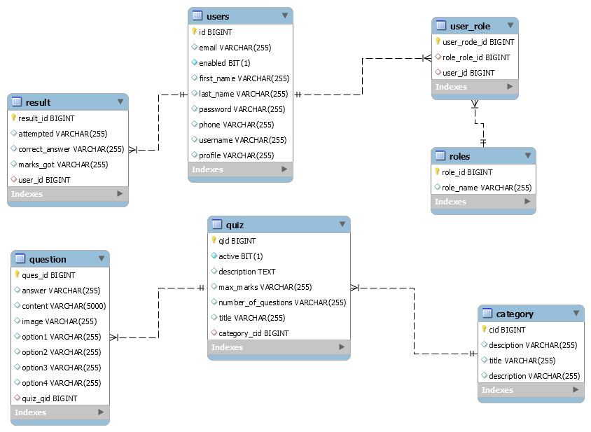

<h1>Exam Portal</h1>
<h2>Overview</h2>
Exam portal is a full stack application that enblaes users(teacher) to create quiz for student. Developed a comperhensive online exam portal designed to facliliate the creation, management and evaluation of exams for educational institutions. The portal provied a user-friendly interface for students, teachers, and administrators, ensuring a seamless examnitation experience. The application ensures security using JWT tokens and adheres to best pratices in REST API design. The backend is built with Spring Boot 2 and Spring Security 6, while the frontend is developed using Angular with Bootstrap & Material UI for styling.

<h2>Features</h2>
<ul>
  <li>User Registration and Authentication, Implemented secure user authentication with role-based access control for students and teachers.</li>
  <li>Enabled teachers to create and manage exams with multiple question types(MCQs).</li>
  <li>Reporting and Analysis, Result will automated immediately once the student submit the quiz.</li>
  <li>Timer is also implemented for quiz, test will automatically submit once the student exceeds the time limit.</li>
  
</ul>

<h3>Class Diagram</h3>

<h3>Spring Security Diagram</h3>

<h2>Technologies Used</h2>
<h4>Backend (Exam Backend)</h4>
<ul>
  <li>Spring Boot 3</li>
  <li>Spring Security 3</li>
  <li>JWT Token Authentication</li>
  <li>Spring Data JPA</li>
  <li>Lombok</li>
</ul>
<h4>Frontend (ExamPortal_UI)</h4>
<ul>
  <li>Angular 17</li>
  <li>Component-Based Architecture</li>
  <li>Authentication Guard</li>
  <li>Angular Material UI</li>
  <li>Bootstrap</li>
</ul>
